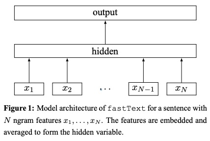
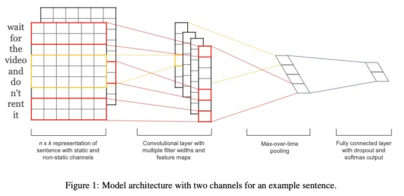
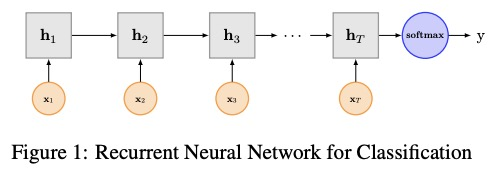
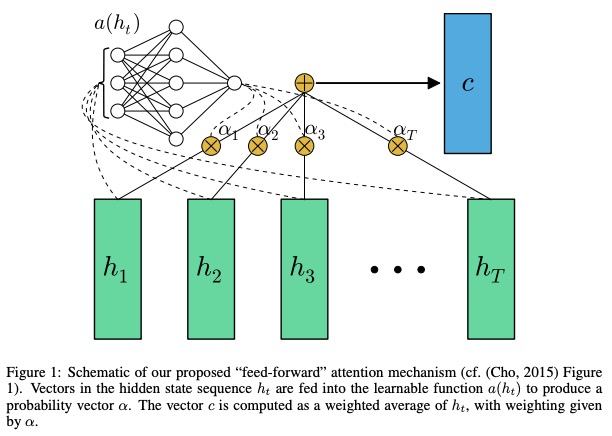

# TextClassification

This code repository implements a variety of **deep learning models** for **text classification** using the **Keras** framework, which includes: **FastText**, **TextCNN**, **TextRNN**, **TextBiRNN**, **TextAttBiRNN**, **HAN**, **RCNN**, **RCNNVariant**, etc. In addition to the model implementation, a simplified application is included.

## Guidance

1. [Environment](#environment)
2. [Usage](#usage)
3. [Model](#model)
    1. [FastText](#1-fasttext)
    2. [TextCNN](#2-textcnn)
    3. [TextRNN](#3-textrnn)
    4. [TextBiRNN](#4-textbirnn)
    5. [TextAttBiRNN](#5-textattbirnn)
    999. [To Be Continued](#to-be-continued)
4. [Reference](#reference)

## Environment

- Python 3.6
- NumPy 1.15.2
- Keras 2.2.0
- Tensorflow 1.8.0

## Usage

All codes are located in the directory ```/model```, and each kind of model has a corresponding directory in which the model and application are placed.

For example, the model and application of FastText are located under ```/model/FastText```, the model part is ```fast_text.py```, and the application part is ```main.py```.

## Model

### 1 FastText

FastText was proposed in the paper [Bag of Tricks for Efficient Text Classification](https://arxiv.org/pdf/1607.01759.pdf).

#### 1.1 Description in Paper



1.	Using a look-up table, **bags of ngram** covert to **word representations**.
2.	Word representations are **averaged** into a text representation, which is a hidden variable.
3.	Text representation is in turn fed to a **linear classifier**.
4.	Use the **softmax** function to compute the probability distribution over the predefined classes.

#### 1.2 Implementation Here

Network structure of FastText: Embedding -> AveragePooling -> FullyConnectedLayer -> Sigmoid/Softmax

### 2 TextCNN

TextCNN was proposed in the paper [Convolutional Neural Networks for Sentence Classification](http://www.aclweb.org/anthology/D14-1181).

#### 2.1 Description in Paper



1. Represent sentence with **static and non-static channels**.
2. **Convolve** with multiple filter widths and feature maps.
3. Use **max-over-time pooling**.
4. Use **fully connected layer** with **dropout** and **softmax** ouput

#### 2.2 Implementation Here

Network structure of TextCNN: Embedding -> MultiConvolution -> MaxPooling -> FullyConnectedLayer -> Sigmoid/Softmax

### 3 TextRNN

TextRNN has been mentioned in the paper [Recurrent Neural Network for Text Classification with Multi-Task Learning](https://www.ijcai.org/Proceedings/16/Papers/408.pdf).

#### 3.1 Description in Paper



#### 3.2 Implementation Here

Network structure of TextRNN: Embedding -> RNN (LSTM/GRU) -> FullyConnectedLayer -> Sigmoid/Softmax

### 4 TextBiRNN

TextBiRNN is an improved model based on TextRNN. It improves the RNN layer in the network structure into a bidirectional RNN layer. It is hoped that not only the forward encoding information but also the reverse encoding information can be considered. No related papers have been found yet.

Network structure of TextBiRNN: Embedding -> BidirectionalRNN (BidirectionalLSTM/BidirectionalGRU) -> FullyConnectedLayer -> Sigmoid/Softmax

### 5 TextAttBiRNN

TextAttBiRNN is an improved model which introduces attention mechanism based on TextBiRNN. For the representation vectors obtained by bidirectional RNN encoder, the model can focus on the information most relevant to decision making through the attention mechanism. The attention mechanism was first proposed in the paper [Neural Machine Translation by Jointly Learning to Align and Translate](https://arxiv.org/pdf/1409.0473.pdf), and the implementation of the attention mechanism here is referred to this paper [Feed-Forward Networks with Attention Can Solve Some Long-Term Memory Problems](https://arxiv.org/pdf/1512.08756.pdf).

#### 5.1 Description in Paper



In the paper [Feed-Forward Networks with Attention Can Solve Some Long-Term Memory Problems](https://arxiv.org/pdf/1512.08756.pdf), the **feed forward attention** is simplified as follows,

<p align="center">
	
</p>

Function `a`, a learnable function, is recognized as a **feed forward network**. In this formulation, attention can be seen as producing a fixed-length embedding `c` of the input sequence by computing an **adaptive weighted average** of the state sequence `h`.

#### 5.2 Implementation Here

The implementation of attention is not described here, please refer to the source code directly.

Network structure of TextAttBiRNN: Embedding -> BidirectionalRNN (BidirectionalLSTM/BidirectionalGRU) -> Attention -> FullyConnectedLayer -> Sigmoid/Softmax

### To Be Continued...

## Reference

1. [Bag of Tricks for Efficient Text Classification](https://arxiv.org/pdf/1607.01759.pdf)
2. [Keras Example IMDB FastText](https://github.com/keras-team/keras/blob/master/examples/imdb_fasttext.py)
3. [Convolutional Neural Networks for Sentence Classification](http://www.aclweb.org/anthology/D14-1181)
4. [Keras Example IMDB CNN](https://github.com/keras-team/keras/blob/master/examples/imdb_cnn.py)
5. [Recurrent Neural Network for Text Classification with Multi-Task Learning](https://www.ijcai.org/Proceedings/16/Papers/408.pdf)
6. [Neural Machine Translation by Jointly Learning to Align and Translate](https://arxiv.org/pdf/1409.0473.pdf)
7. [Feed-Forward Networks with Attention Can Solve Some Long-Term Memory Problems](https://arxiv.org/pdf/1512.08756.pdf)
8. [cbaziotis's Attention](https://gist.github.com/cbaziotis/6428df359af27d58078ca5ed9792bd6d)
